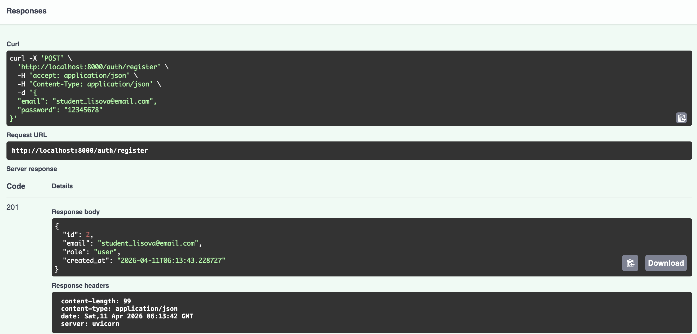
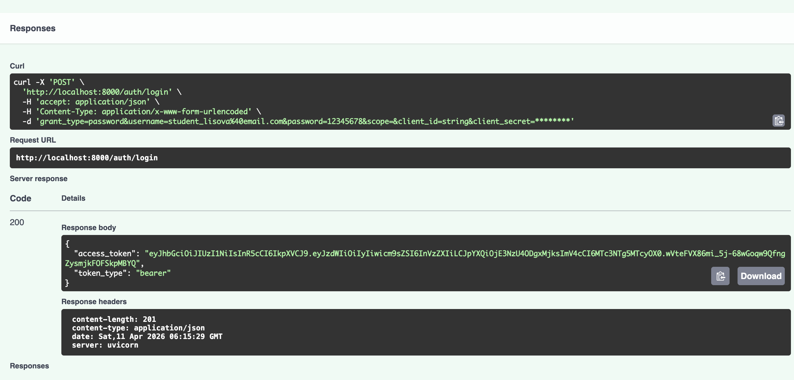
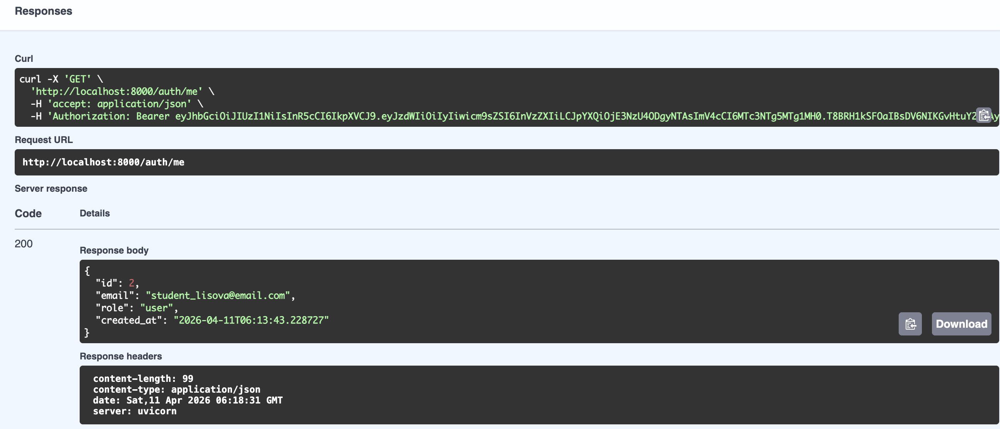
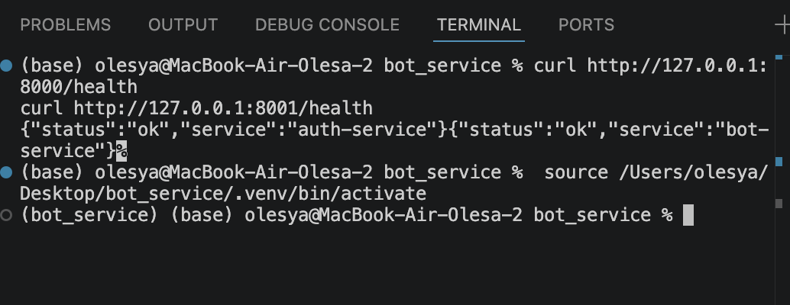
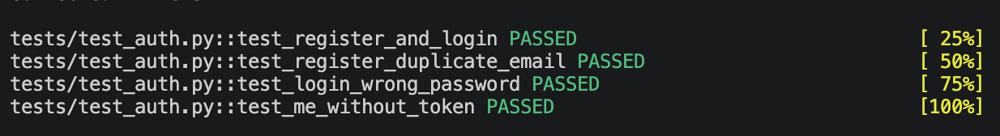

# Auth Service - сервис аутентификации и выдачи JWT

## Описание проекта

Auth Service является первой частью двухсервисной системы LLM-консультаций. Сервис отвечает исключительно за аутентификацию, регистрацию пользователей и выпуск JWT-токенов. Bot Service (Telegram бот) использует эти токены для авторизации пользователей, не имея доступа к базе данных пользователей.

## Что сделано

- Реализована регистрация пользователя с хешированием пароля (bcrypt)
- Реализован логин с проверкой пароля и выдачей JWT токена
- JWT токен содержит поля: sub (id пользователя), role, iat (время выдачи), exp (время истечения)
- Реализован защищённый эндпоинт /auth/me для получения данных пользователя по токену
- Написаны модульные и интеграционные тесты (4 теста проходят успешно)
- Добавлена централизованная обработка ошибок (409, 401, 404)
- Подключена автоматическая документация Swagger
- Код проверен линтером ruff (All checks passed)

## Технологии

FastAPI, SQLAlchemy, SQLite, JWT (python-jose), bcrypt (passlib), Pydantic-settings, pytest, ruff

## Запуск

cd ~/Desktop/auth_service
source .venv/bin/activate
uvicorn app.main:app --reload --host 0.0.0.0 --port 8000

Swagger: http://127.0.0.1:8000/docs

## Эндпоинты

POST /auth/register - регистрация нового пользователя
POST /auth/login - вход, получение JWT токена
GET /auth/me - получение профиля текущего пользователя
GET /health - проверка работоспособности сервиса

## Демонстрация работы

### Регистрация

### Логин (получение JWT токена)

### Профиль пользователя (/auth/me)

### Healthcheck

## Тестирование

Команда: pytest -v

Результат: 4 passed

## GitHub

https://github.com/olesya025/auth-service

## Автор

Лисова Олеся